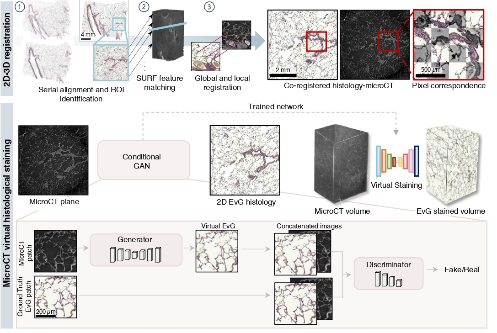

VISTACT: VIrtual histological STAining of micro-Computed Tomography<!-- omit in toc -->
===

 

- [Getting started](#getting-started)
- [Step-by-step tutorial](#step-by-step-tutorial)
  - [1. Registration](#1-co-registration)
  - [2. Preprocessing](#2-preprocessing)
  - [3. Virtual staining](#3-virtual-staining)


# Getting started

The code of this project is based on **MATLAB 2022a** and **Python 3.11.11** softwares. The python scripts require the following installations:
```bash
module load Python/3.11.11 # Load your python - this is the command for PSI computing system
python -m venv vistact
source vistact/bin/activate
pip install -r requirements.txt
pip install torch==2.4.0 torchvision==0.19.0 --index-url https://download.pytorch.org/whl/cu121
```

VISTACT builds on top of the following repository for image co-registration:

```bash
cd base/
git clone https://github.com/Fouga/SliVo.git
```

VISTACT builds on top of *pix2pix* conditional GAN for virtual staining:

```bash
cd virtual_staining/Model_cGAN/
git clone https://github.com/junyanz/pytorch-CycleGAN-and-pix2pix.git
```


# Step-by-step tutorial


## 1. Co-registration

Registration of 2D histological sections to 3D µCT volumes.

### 1.1 - Preprocessing: Serial registration of histological sections and rough ROI identification.

**1.1.1. Convert histologies from .svs format (raw microscopy format) to readable format in python (*.tif):**

```bash
cd registration/
python convert_svs_to_tif.py \
--pth <PTH> \
--nm_outpth <OUTPUT_NAME> \
--resHisto <RES_HISTO> \
--resNew <RES_OUTPUT>
```

- ```--pth```: Directory containing histolgoical images in *.svs* format.
- ```--nm_outpth```: Name of the output directory to save images in *.tif* format (e..g, res_1).
- ```--resHisto```: Pixel size (in µm) of the histology images.
- ```--resNew```: New pixel size (in µm). This should match the pixel size of microCT images.


**1.1.2. Co-registration of serial histological sections using intensity-based registration:**

```bash
cd registration/
matlab -nodisplay -nosplash -r "coregister_histologies('pth_histo',<PTH_HISTO>); exit"
```

- ```--pth_histo```: Directory containing serial histological sections in *.tif* format.

**1.1.3. Rough ROI identification**

Using a software such as *ImageJ*, visualize the previous histologies and manually roughly identify the ROI where microCT was acquired. This ROI does not need to be perfect, we will correct for small differences in field-of-view during co-registration. With this, you can define bb = [x0,y0,x1,y1] where (x0,y0) are the top-left coordinates of the ROI and (x1,y1) are the bottom-right coordinates. With this information, you can run the following script, which will crop the ROI for all the sections in the stack:

```bash
cd registration/
matlab -nodisplay -nosplash -r "crop_roi('pth_historeg','<PTH_HISTO_REG>','bb',<BB>); exit"
```
- ```--pth_histo_reg```: Directory containing registered serial histological sections. Use ``<PTH_HISTO>/Co-Registered/`` where PTH_HISTO is the path defined in the previous step.


### 1.2 - Search of the µCT plane corresponding to the histological ROI.

```bash
cd registration/
matlab -nodisplay -nosplash -r "find_microct_plane('pthCT','<PTH_CT>','pthHE','<PTH_HE>','outpth','<OUTPTH>','start_slice',<START_SLICE>,'finish_slice',<FINISH_SLICE>,'res_microct',<RES_MICROCT>); exit"
```

- ```--pthCT```: Directory containing the axial slices of the μCT volume in .tif format.
- ```--pthHE```: Directory containing the histology ROIs at the resolution of the μCT.
- ```--outpth```: Output directory.
- ```--start_slice```: First axial slice that you expect the histology can correspond (e.g. first slice with tissue).
- ```--finish_slice```: Last axial slice that you expect the histology can correspond (e.g. last slice with tissue).
- ```--res_microct```: MicroCT resolution (e.g., 1.63 in VISTACT).


Once you have applied this co-registration step to all the volumes with serial histological sections place all the output microct planes in one directory. These planes can be found within each ```<OUTPTH>/data/FoundPlane/high_resolution/ ```. Then, do the same for the ROIs that you identified in step 1.1.3. These will define the ```pthCT``` and ```pthHE``` for the final registration step.


### 1.3 - 2D multimodal image registration of µCT - histology image pairs.

Two-stage registration (feature-based global registration followed by feature-based local registration using SURF descriptors):

```bash
cd registration/
matlab -nodisplay -nosplash -r "coregister_pairs('pthCT','<PTH_CT>','pthHE','<PTH_HE>','outpth','<OUTPTH>'); exit"
```

- ```--pthCT```: Directory containing μCT planes.
- ```--pthHE```: Directory containing histological ROIs .
**Note**: Paired μCT/histologies should have the same name.
- ```--outpth```: Output directory to save registered histological sections.


Finally, to evaluate the quality of registration based on annotated fiducials (e.g., using ImageJ), we used the script **registration_evaluation.m**. 


## 2. Preprocessing

### **2.1 - Stain normalization in histology images**

Normalize the stain across all the images used in training:

```bash
cd preprocessing/
python histology_colour_normalization.py --target_name <TARGET_NAME> --pth <PTH> 
```
- ```--target_name```: Name of the histology image used as reference (target).
- ```--pth_histo```: Directory containing all histology images to be normalized, after image registration applied to all patients/volumes.

### **2.2 - Intensity normalization in microCT**

Correct for the *local tomography artefact*, remove air bubbles, and apply percentile normalization for contrast enhancement:

```bash
cd preprocessing/
matlab -nodisplay -nosplash -r "background_illumination_correction_ct('pth_ct',<PTH_CT>>); exit"
```

- ```--pth_ct```: Directory containing microCT planes to be normalized.

## 3. Virtual staining

### **3.1 - Dataset for model training**


**3.1.1 - Create dataset**

Generate image patches from co-registered microCT - histology:

```bash
cd virtual_staining/
matlab -nodisplay -nosplash -r "create_dataset('pth_ct',<pthCT>,'pth_histo',<pthHISTO>,'patch_sz',512); exit"
```

- ```--pthCT```: Directory containing microCT planes after image pre-processing.
- ```--pthHISTO```: Directory containing Histology images after image pre-processing.

**3.1.2 - Filter high-quality patches (Optional)**

In the previous step, we already ensure that only well-registered patches based on the their correlation coefficient are kept for training. 
However, for further checking, and manual inspection of individual patches, you can check the script ```quality_check.m```.

**3.1.3 - Split intro training/test cohorts**

```bash
cd virtual_staining/
matlab -nodisplay -nosplash -r "train_test_splits('pth_ct_patches',<pthCT_patches>,'pth_histo_patches',<pthHISTO_patches>,'output_dir',<OUTPUT_DIR>); exit"
```
- ```--pthCT_patches```: ```pthCT```/Patches_512/, where ```pthCT``` was defined in the previous step.
- ```--pthHISTO_patches```: ```pthHISTO```/Patches_512/, where ```pthHISTO``` was defined in the previous step.
- ```--output_dir```: output directory. It will generate two subfolders ```A``` and ```B``` containing the train and test splits for microCT and histology, respectively.

**3.1.4 - Data augmentation for underrepresented biological structures (Optional)**

It is possible that certain biological structures appear in only a small percentage within the training image patches. To increase the representation of these structures, we can apply data augmentation (e.g., rotation, translation...) so the model learns to virtually stain them. In ```image_augmentation.m```, we have created a script for a GUI where the user can select those patches with the biological structures to be augmented. In our case, we selected blood vessels and pulmonary airways which were underrepresented in our dataset compared to the lung parenchyma.

**3.1.5 - Prepare data as required by *pix2pix***

```bash
cd virtual_staining/Model_cGAN/pytorch-CycleGAN-and-pix2pix/
python datasets/combine_A_and_B.py --fold_A <FOLD_MICROCT> --fold_B <FOLD_HISTO> --fold_AB <FOLD_CONCATENATED>
```

- ```--fold_A```: Directory of microCT image patches. Refer to ```<OUTPUT_DIR>/A/``` from the previous step.
- ```--fold_B```: Directory of histology image patches. Refer to ```<OUTPUT_DIR>/B/``` from the previous step.
- ```--fold_AB```: Output directory of concatenated image patches for *pix2pix* training (e.g., ```<OUTPUT_DIR>/AB/```).


### **3.2 - Model training**


```bash
cd virtual_staining/Model_cGAN/pytorch-CycleGAN-and-pix2pix/
python train.py \
--dataroot <DATA_ROOT>  \
--name <EXP_NAME> \
--model pix2pix \
--direction AtoB \
--batch_size 5 \
--num_threads 0 \
--preprocess 'none' \
--dataset_mode 'aligned' \
--input_nc 1 
```

- ```--dataroot```: Path to images (should have subfolders train and test). Refer to ```fold_AB``` from previous step.
- ```--name```: Name of the experiment. It decides where to store samples and models (e.g., ```vistact_exp``` ).

In ```checkpoints/<EXP_NAME>/web/images/```, you can check the progress of virtual staining for different training epochs.

### **3.3 - Model evaluation**

**3.3.1 - Virtual staining on the test set**

```bash
cd virtual_staining/Model_cGAN/pytorch-CycleGAN-and-pix2pix/
python test.py --dataroot  <DATA_ROOT> --name  <EXP_NAME> --model pix2pix --direction AtoB --preprocess 'none' --dataset_mode 'aligned' --input_nc 1 --epoch 200 --load_size 512 --num_test 100000 
```

- ```--dataroot```: Path to images (should have subfolders train and test). Refer to ```fold_AB``` from previous step.
- ```--name```: Name of the experiment. Same name as above.

Virtually-stained images are saved in ```results/<EXP_NAME>/test_200/images/```. Here you can check the progress of virtual staining for different training epochs. Finally, save virtually stained image patches as *.tif* files:

```bash
cd virtual_staining/
python save_as_tif.py --results_dir <RESULTS_DIR>
```
- ```--results_dir```: Directory with virtually stained images in the test set ```results/<EXP_NAME>/test_200/images/``` (use full path).


**3.3.2 - PSNR, MSE, SSIM metrics**

Calculation of the MSE (Mean Squared Error), SSIM (Structural Similarity Index Metric), and PSNR (Peak Signal-to-Noise Ratio):

```bash
cd virtual_staining/
matlab -nodisplay -nosplash -r "evaluate_virtual_staining('pth_gt',<PTH_GT>,'pth_pred',<PTH_PRED>); exit"
```

- ```PTH_GT```: ```<OUTPUT_DIR>/B/test/```, where *OUTPUT_DIR* was defined in step 3.1.3.
- ```PTH_PRED```: Output directory of the previous step: ```.../results/<EXP_NAME>/test_200/images/``` (use full path).


**3.3.3 - LPIPs metric**

The calculation of *LPIPs* (Learned Perceptual Image Patch Similarity) metric requires to clone the following repository:
```bash
cd virtual_staining/
git clone https://github.com/richzhang/PerceptualSimilarity
```
Then, include the *lpips_2dirs_stats.py* script within the *PerceptualSimilarity* folder. This is a modification of the *lpips_2dirs.py* script, which also calculates the mean (± standard deviation) *LPIPs* metric of a set of images.

Finally, to calculate the *LPIPs* metric between the ground truth histology images and the virtually stained µCT images, do as follows:

```bash
cd PerceptualSimilarity/
python lpips_2dirs_stats.py -d0 <PTH_PRED> -d1 <PTH_GT> -o <PTH_GT>/dists.txt  --use_gpu
```

*<PTH_GT>* is defined as above and *<PTH_PRED>* refers to the directory with virtually-stained images in.tif format (e.g., ```.../results/<EXP_NAME>/test_200/images/images_tif/``` )


### **3.4 - Virtually stain a volumetric microCT image by applying the model to each axial plane**

First, we will normalize the images and preprocess them as required for virtual staining:

```
cd preprocessing/
matlab -nodisplay -nosplash -r "background_illumination_correction_ct('pth_ct',<PTH_CT_VOLUME>,'pp_pix2pix', 1); exit"
```

- ```--pth_ct```: Directory containing microCT volume as stack of *.tif* files (each axial plane is a *.tif* file).


Virtually stain the images with the *pix2pix* model we have trained:

```bash
cd virtual_staining/Model_cGAN/pytorch-CycleGAN-and-pix2pix/ \
python test.py \
--dataroot  <DATA_ROOT> \
--results_dir <RESULTS_DIR>
--name  <EXP_NAME> \ 
--model pix2pix \ 
--direction AtoB \ 
--preprocess 'none' \ 
--dataset_mode 'aligned' \ 
--input_nc 1 \
--epoch 200 \
--load_size <LOAD_SIZE> \
--num_test 100000 
```

- ```--load_size``` : Side dimensions of the microCT images. In VISTACT, we used 2560. 
- ```--dataroot```: Path to preprocessed microCT images: ```<PTH_CT_VOLUME>/preprocessed/```
- ```--results_dir```: Path to save virtually stained axial microCT planes.
- ```--name```: Name of the experiment. Same name as above (model training).

Virtually-stained images are saved in ```<RESULTS_DIR>/<EXP_NAME>/test_200/images/```.

## Applications

Finally, in our study, we used virtual histological EvG staining to explore human tissue specimens with pulmonary hypertension. The scripts used for collagen segmentation can be found in the ```segmentation``` folder.

# Issues

- The preferred mode of communication is via GitHub issues.
- If GitHub issues are inappropriate, email goran.lovric@psi.ch and calmagro@mit.edu .

# Funding
This work was partially funded by La Caixa Postgraduate Fellowship.

# License and Terms of Use
This code is made available under the CC-BY-NC-ND 4.0 License and is available for non-commercial academic purposes.

# Acknowledgements
The project was built on top of amazing repositories such as [Pix2Pix](https://github.com/junyanz/pytorch-CycleGAN-and-pix2pix.git), and [SliVo](https://github.com/Fouga/SliVo). We thank the authors and developers for their contribution. 

# Cite<a id='ack'></a>
If you find our work useful in your research, please cite our paper:

```bibtext
@article{almagro2025histology,
  title={Histology-guided 3D virtual staining of microCT-imaged lung tissue via deep learning},
  author={Almagro-P{\'e}rez, Cristina and Peruzzi, Niccol{\`o} and Galambos, Csaba and Song, Andrew H and Brunnstr{\"o}m, Hans and Gawlik, Kinga I and Stampanoni, Marco and Tran-Lundmark, Karin and Lovric, Goran},
  journal={bioRxiv},
  pages={2025--10},
  year={2025},
  publisher={Cold Spring Harbor Laboratory}
}
```


 
